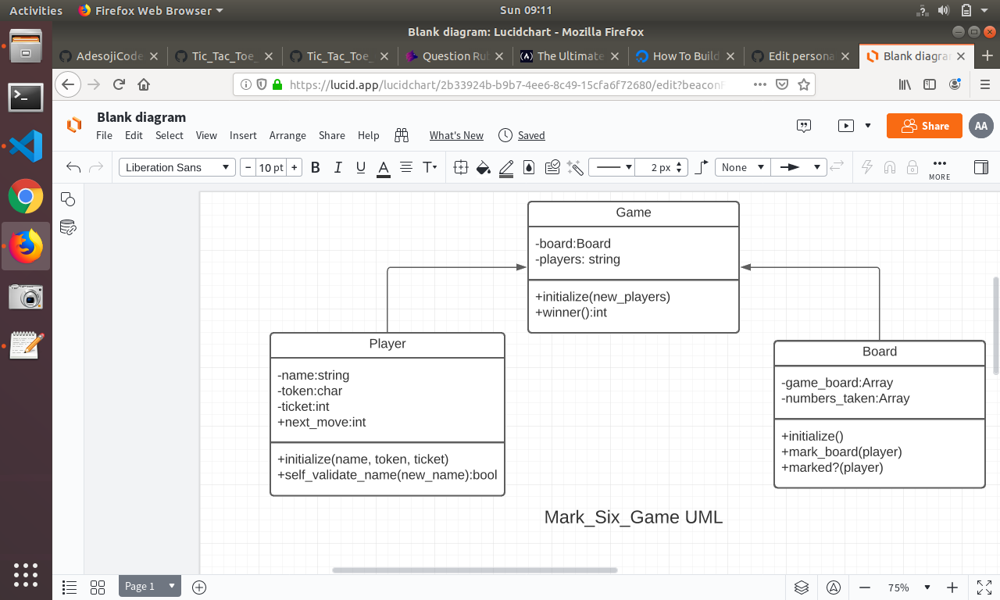
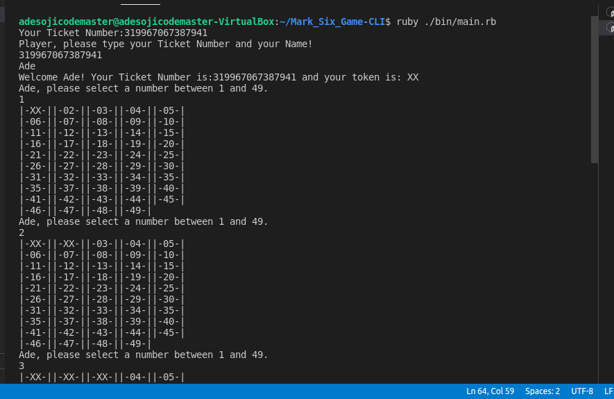
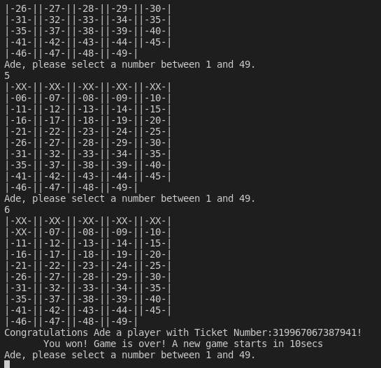

# Mark_Six_Game-CLI

> This is a Mark_Six_Game made with Ruby backend language. A test project at GogoX in HongKong.

## Project requirements
- All user interaction and game flow should be placed in lib and bin folders with corresponding ruby files.
- Use object oriented programming.

## UML Class diagram



## Built using

- Ruby
- Gitflow Workflow
- Rubocop

### Game rules:
- The game board is a 5x10 grid.
- The player will make a request for a unique ticket and validate before playing.
- The default token for all players to mark the board is "XX". 
- The motive of the game is for the player to predict 6 numbers correctly out of numbers      rangiing from 1 to 49 on the board which must be the same with the game's lucky numbers.
- The player/players can mark anywhere on the board with the token to move round.
- If the player/players finished a draw, he will be asked to wait for 10seconds before playing 
a new game.

## Test Screenshot



## Getting Started

### How to run the game?
1 -> Clone this repo and open a terminal inside the folder where you extracted it.

2 -> Run `./bin/main.rb` OR `ruby ./bin/main.rb` in your terminal.
 
```
  |-XX-||-XX-||-XX-||-XX-||-05-|
  |-XX-||-07-||-08-||-XX-||-10-|
  |-11-||-12-||-13-||-14-||-15-|    
```
The players/player can continue to play the game as long as the way after every 10 seconds holding time. 
### Prerequisites
- Ruby

## Authors
👤 **Adesoji Adewumi**
- Github: [@AdesojiCodeMaster](https://github.com/AdesojiCodeMaster) 
- Twitter: [@codemas22665735](https://twitter.com/codemas22665735) 
- Linkedin: [linkedin](https://www.linkedin.com/in/adesoji-adewumi-7752aba5)

## 🤝 Contributing
Contributions, issues and feature requests are welcome!

## Show your support
Give a ⭐️ if you like this project!


